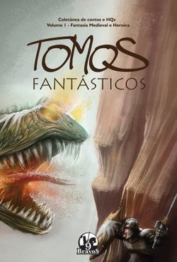
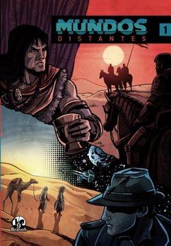
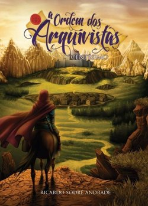
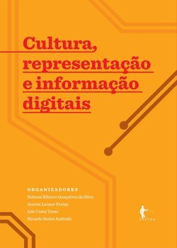

## Sobre

Relação das publicações acadêmicas de Ricardo Sodré Andrade, organizadas por tipo. Período: 2004–2026.

:::{data-i18n="books-title"}
## Livros
:::

Quatro livros publicados, sendo um como autor e três como organizador.

### Tomos Fantásticos: Fantasia Medieval e Heroica

{width="200px" fig-class="book-cover"}

**Papel:** Organizador · **Editora:** 9Bravos · **Ano:** 2014

[Skoob](https://www.skoob.com.br/pt/book/429771)

### Mundos Distantes 1

{width="200px" fig-class="book-cover"}

**Papel:** Organizador · **Editora:** 9Bravos · **Ano:** 2013

[Amazon](https://www.amazon.com.br/Mundos-Distantes-Ricardo-Sodr%C3%A9-Andrade/dp/8567178002)

### A Ordem dos Arquivistas: centésimo

{width="200px" fig-class="book-cover"}

**Papel:** Autor · **Editora:** 9Bravos · **Ano:** 2011

[Livraria 9Bravos (arquivo)](https://web.archive.org/web/20251213092545/https://livraria.9bravos.com.br/produto/a-ordem-dos-arquivistas-centesimo/)

### Cultura, representação e informação digitais

{width="200px" fig-class="book-cover"}

**Papel:** Organizador · **Editora:** EDUFBA · **Ano:** 2010

[Repositório UFBA](https://repositorio.ufba.br/handle/ri/7315)

:::{data-i18n="articles-title"}
## Artigos em periódicos
:::

Dez artigos publicados em periódicos científicos nacionais e internacionais.

1. **A iniciativa Legatum e a preservação digital de arquivos audiovisuais públicos**. Silva, E. C. L.; Hollós, A. C.; Andrade, R. S.; Pavezi, N. *Revista Digital de Biblioteconomia e Ciência da Informação*, v. 14, n. 3, 2016. [Artigo](https://periodicos.sbu.unicamp.br/ojs/index.php/rdbci/article/view/8646279)

2. **Políticas de informação e comunicação, participação social e controle da gestão pública**. Jambeiro, O.; Andrade, R. S.; Sobreira, F.; Rabelo, J. *Verso e Reverso*, v. XXII, n. 51, 2008. [Artigo](https://www.semanticscholar.org/paper/Pol%C3%ADticas-de-informa%C3%A7%C3%A3o-e-comunica%C3%A7%C3%A3o%2C-participa%C3%A7%C3%A3o-Jambeiro-Sobreira/ee78dcf16511643e1df56ff40944cb6637d21f7b)

3. **Aspectos teóricos e históricos da descrição arquivística e uma nova geração de instrumentos arquivísticos de referência**. Andrade, R. S.; Silva, R. C. *PontodeAcesso*, v. 2, n. 2, p. 14–29, 2008. [Repositório UFBA](https://repositorio.ufba.br/bitstream/ri/1191/1/2335.pdf)

4. **Information professionals in Brazil: core competencies and professional development**. Ferreira, S. M. S. P.; Nascimento, M. J.; Andrade, R. S. et al. *Information Research*, v. 12, n. 2, 2007. [Artigo](https://informationr.net/ir/12-2/paper299.html)

5. **Aspectos introdutórios da representação de informação arquivística: a Nobrade, a EAD-DTD e o projeto Archives Hub**. Andrade, R. S. *PontodeAcesso*, v. 1, n. 1, p. 70–100, 2007. [Artigo](https://arquivistica.fci.unb.br/au/aspectos-introdutorios-da-representacao-de-informacao-arquivistica-a-norma-brasileira-de-descricao-arquivistica-nobrade-a-descricao-arquivistica-codificada-ead-dtd-e-o-projeto-archives-hub/)

6. **Acessibilidade, navegabilidade e conteúdos em portais e websites de governo eletrônico em capitais brasileiras**. Jambeiro, O.; Borges, J.; Andrade, R. S. *Comunicação & Informação*, v. 9, n. 2, p. 200–213, 2006. [Artigo](https://revistas.ufg.br/ci/article/view/25250)

7. **Tecnologia, memória e a formação do profissional arquivista**. Andrade, R. S. *Arquivística.net*, v. 2, n. 2, p. 149–159, 2006. [Artigo](https://arquivistica.fci.unb.br/au/tecnologia-memoria-e-a-formacao-do-profissional-arquivista/)

8. **Preservação digital e os profissionais da informação**. Arellano, M. A. M.; Andrade, R. S. *Datagramazero*, v. 7, n. 5, 2006. [Artigo](https://pbcib.com/pbcib/article/view/8036)

9. **Digitalizando a memória de Salvador: nossos presente e passado têm futuro?**. Andrade, R. S.; Borges, J.; Jambeiro, O. *Perspectivas em Ciência da Informação*, v. 11, p. 243–254, 2006. [DOI: 10.1590/S1413-99362006000200006](https://doi.org/10.1590/S1413-99362006000200006)

10. **Políticas de informação: Digitalizando a inclusão social**. Andrade, R. S. et al. *Estudos de Sociologia*, v. 17, n. 1, p. 147–169, 2004. [Artigo](https://periodicos.fclar.unesp.br/estudos/article/view/135)

:::{data-i18n="conferences-title"}
## Comunicações em eventos
:::

Vinte e uma comunicações apresentadas em eventos científicos nacionais e internacionais.

1. **The Legatum initiative: Challenges and alternatives to a Brazilian experiment of remote access**. Silva, E. C. L.; Andrade, R. S.; Hollós, A. C.; Pavezi, N.; Santos, G. C. *Unlocking Sound and Image Heritage*, SOIMA/ICCROM, p. 101–107, 2017. [ICCROM](https://www.iccrom.org/sites/default/files/2017-12/00_soima_unlocking_sound_and_image_heritage_0.pdf)

2. **Média sociais em instituições arquivísticas públicas de países lusófonos: visita aos websites de Brasil e Portugal**. Andrade, R. S.; Oliveira, L. A. *CIBERCULTURA: Circum-navegações em Redes Transculturais*, LASICS/UMinho, 2016. [PDF](http://www.lasics.uminho.pt/cibercultura2016/wp-content/uploads/2017/12/2017_cibercultura.pdf)

3. **Salvaguarda e preservação digital do patrimônio audiovisual em instituições públicas no Brasil**. Silva, E. C. L.; Hollós, A. C.; Andrade, R. S.; Pavezi, N.; Santos, G. C.; Pereira, A. C.; Oliveira, B. M.; Garcia, F. F.; Santos, M. B.; Oliveira, T. S.; Franca, V. V. *Arquivo em Cartaz: Festival Internacional de Cinema de Arquivo*, v. 2, p. 32–39, 2016.

4. **Salvaguardia y conservación del patrimonio audiovisual en las instituciones públicas en Brasil**. Silva, E. C. L.; Andrade, R. S.; Santos, G. C.; Pavezi, N.; Hollós, A. C. *Jornadas Latinoamericanas de Archivos*, Universidad Complutense de Madrid, 2015. [E-Prints UCM](https://eprints.ucm.es/34584/)

5. **Patrimônio documental audiovisual em instituições de idioma de origem latina: desafios e alternativas para um experimento brasileiro de acesso remoto**. Silva, E. C. L.; Hollós, A. C.; Santos, G. C.; Pavezi, N.; Andrade, R. S. *XII CINFORM: Encontro Nacional de Pesquisa e Ensino em Informação*, p. 371–383, 2015.

6. **Media sociais, lusofonia e instituições arquivísticas: as relações de conceito de uma investigação iniciada**. Andrade, R. S. *VI Congresso Nacional de Arquivologia*, 2014.

7. **Uma nova geração de instrumentos arquivísticos de referência: a publicação dos produtos das descrições arquivísticas em meio eletrônico**. Andrade, R. S.; Silva, R. C. *II Simpósio Baiano de Arquivologia*, 2009. [Artigo](https://arquivistica.fci.unb.br/au/uma-nova-geracao-de-instrumentos-arquivisticos-de-referencia-a-publicacao-dos-produtos-das-descricoes-arquivisticas-em-meio-eletronico/)

8. **Uma nova geração de instrumentos arquivísticos de referência: a publicação dos produtos das descrições arquivísticas em meio eletrônico**. Andrade, R. S.; Silva, R. C. *IX CINFORM: Encontro Nacional de Ensino e Pesquisa em Informação*, 2009.

9. **Descrição arquivística e a nova geração de instrumentos arquivísticos de referência: as novas possibilidades da internet, os arquivos públicos estaduais e o Arquivo Nacional do Brasil**. Andrade, R. S.; Silva, R. C. *X ENANCIB: Encontro Nacional de Pesquisa em Ciência da Informação*, 2009.

10. **Aspectos teóricos e históricos da descrição arquivística e uma proposta de nova geração de instrumentos arquivísticos de referência**. Andrade, R. S.; Silva, R. C. *VIII CINFORM: Encontro Nacional de Ensino e Pesquisa em Informação*, 2008.

11. **Uma nova geração de instrumentos arquivísticos de referência: a publicação dos produtos das descrições arquivísticas em meio eletrônico**. Andrade, R. S.; Silva, R. C. *III Congresso Nacional de Arquivologia*, 2008.

12. **Guia digital de fundos do Arquivo Público da Bahia: relato das ações realizadas com vistas à implantação do ICA-AtoM**. Andrade, R. S. *XV Congresso Brasileiro de Arquivologia*, 2008.

13. **Construção de sistemas web para acesso a representações de informação arquivística permanente: algumas indicações de critérios e componentes**. Andrade, R. S. *I Simpósio Baiano de Arquivologia*, 2007.

14. **Salvador Conectada: serviços de informação oferecidos pela Prefeitura Municipal e suas secretarias**. Sobreira, F.; Andrade, R. S.; Barros, O.; Jambeiro, O. *XXII Congresso Brasileiro de Biblioteconomia, Documentação e Ciência da Informação*, 2007.

15. **Acesso à informação baseado em Open Archives: a experiência do Holmes**. Oddone, N.; Andrade, R. S. *XIV SNBU: Seminário Nacional de Bibliotecas Universitárias*, 2006. [PDF](http://repositorio.febab.org.br/files/original/47/5703/SNBU2006_314.pdf)

16. **Disseminando o conhecimento científico em Música por meio do conceito de Open Archives**. Andrade, R. S.; Blanco, P. S. *XIV SNBU: Seminário Nacional de Bibliotecas Universitárias*, 2006. [PDF](http://repositorio.febab.org.br/files/original/47/5182/SNBU2006_146.pdf)

17. **Conhecimento científico em Música e Open Archives: vantagens de uma aproximação**. Andrade, R. S.; Blanco, P. S. *XVI Congresso da ANPPOM*, Comissão de Musicologia, 2006. [PDF](https://anppom.org.br/anais/anaiscongresso_anppom_2006/CDROM/COM/04_Com_Musicologia/sessao03/04COM_MusHist_0303-018.pdf)

18. **A Criação da Rede de Arquivos de Minas Gerais – RAMG**. Ribeiro, F. A.; Di Mambro, R. C. M.; Parrela, M. A.; Andrade, R. S. *VI Congresso de Arquivologia do Mercosul*, 2005.

19. **A face oculta da interface: serviços de informação arquivística na web centrados no usuário**. Sá, I. M. A.; Andrade, R. S. *VI Congresso de Arquivologia do Mercosul*, 2005.

20. **Políticas de formação de profissionais da informação e competências essenciais**. Ferreira, S. M. S. P.; Barros, O.; Ferreira, T. M. M.; Nascimento, M. J.; Andrade, R. S.; Santos, N. R. *V CINFORM: Encontro Nacional de Ciência da Informação*, 2004.

21. **Digital exclusion in Salvador: testing the politics of inclusion**. Jambeiro, O.; Simões, J.; Ferreira, S. M. S. P.; Andrade, R. S.; Barros, O.; Ferreira, T. M. M.; Nascimento, M. J. *The First Brazil-US Colloquium on Communication Studies*, Austin, 2004.

:::{data-i18n="preprints-title"}
## Preprints
:::

1. **Social-RAG: A Retrieval-Augmented Generation Pipeline for Computational Social Science Research on Telegram**. Nascimento, T. A.; Brasil, A.; Santos, G.; Andrade, G.; Andrade, R. S.; Barreto, E. *SocArXiv*, 2026. [Preprint](https://osf.io/preprints/socarxiv/wmc2q_v1)